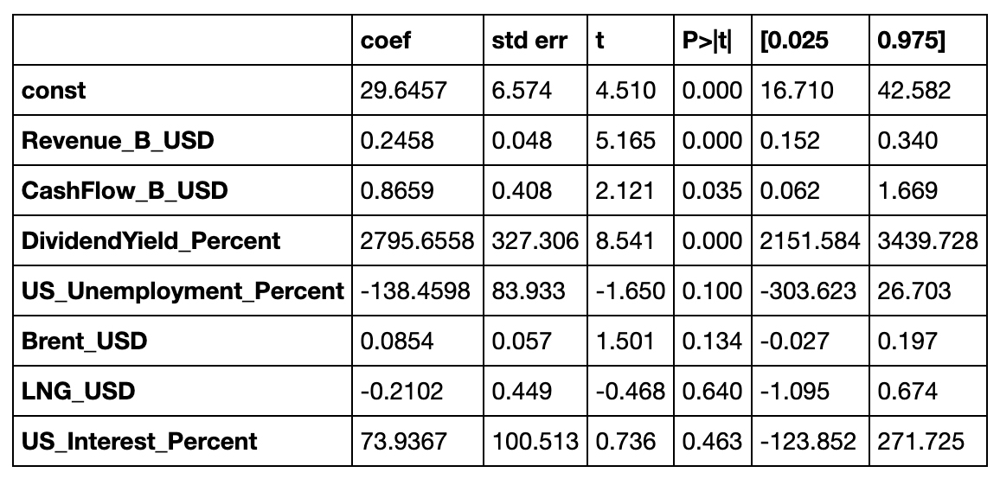

# Machine Learning Meets Energy Share Prices

## Project Question:
### Do external and internal factors have an impact on the share price of Energy companies? If so, which factors are more important?

## Objective:
### Use statistical models & Machine Learning libraries to test the relationship between internal/external variables and Energy Company share prices.

## Project Summary:
A million-dollar question is what factors can be used to predict future share prices? Our humble attempt was to brainstorm what internal & external factors would most likely impact share prices of large Energy companies. Four factors for each were selected:

**Internal:** Revenue, Expenses, Divident Yield, & Cash Flow

**External:** US Interest Rate, US Unemployment Rate, Brent Oil Price, & LNG Price

We gathered quarterly data from the years 2005-2017 using Yahoo Finance, FRED, & Macrotrends websites. Data was gathered for 6 selected large energy companues: Exxon ( XOM ), BP, Equinor ( EQNR ), Chevron ( CVX ), Shell ( RDS-A ), & Total ( TOT ). This created a dataset of 312 records. 

We started by running a coefficient matrix to check that all variables were independent of each other. It was found that Expenses & Revenue were highly related, therefore we decided to drop Expenses to reduce bias in the dataset. Then we ran a statistical summary to check the significance. It was found that Revenue, Dividend Yield, Cash Flow, & Unemployment Rate were all significant and the remaining variables were insignificant. 

After having a general idea of the data, we moved to the next step of building ML models. The sklearn library was used to build the model. We began with a linear regression model because it seemed best suited for the data as proven by the residual plot that showed data points scattered around the horizonal line. The R2 score was .364 which meant there was a weak or low relationship between the dependent & independent variables.

Other linear models used were Lasso, Ridge, & ElasticNet that reduce variation in the data by increasing bias and penalizing the coefficients that are farther from zero. Still, all of these models showed a weak relationship between indepent and dependent variables. All has MSE above .8 and R2 score below .30, which means there is a very weak relationship.
